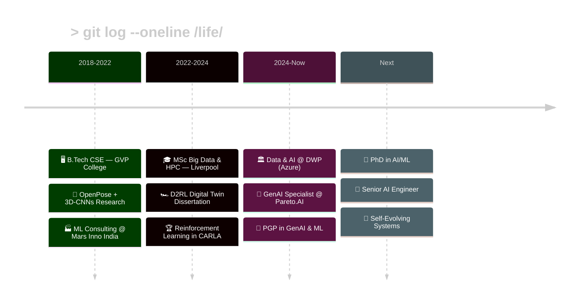

ＲＡＭ｜羅夢
<!-- 
  ████████████████████████████████████████████████████████████████
  █  NAGA SRI RAM KOCHETTI — GITHUB PROFILE TERMINAL v1.0         █
  █  Aesthetic: 1980s Green Phosphor CRT Monitor                  █
  █  All images tested against GitHub's markdown renderer         █
  ████████████████████████████████████████████████████████████████
-->

<div align="center">


<a href="https://www.nagasriram.com">
  
</a>

<br/>

```
┌────────────────────────────────────────────────────────────────────────────────────────────────────────────────┐
│                                                                                                                │
│   ███╗   ██╗ █████╗  ██████╗  █████╗     ███████╗██████╗ ██╗         ██████╗  █████╗ ███╗   ███╗               │
│   ████╗  ██║██╔══██╗██╔════╝ ██╔══██╗    ██╔════╝██╔══██╗██║         ██╔══██╗██╔══██╗████╗ ████║               │
│   ██╔██╗ ██║███████║██║  ███╗███████║    ███████╗██████╔╝██║         ██████╔╝███████║██╔████╔██║               │
│   ██║╚██╗██║██╔══██║██║   ██║██╔══██║    ╚════██║██╔══██╗██║         ██╔══██╗██╔══██║██║╚██╔╝██║               │
│   ██║ ╚████║██║  ██║╚██████╔╝██║  ██║    ███████║██║  ██║██║         ██║  ██║██║  ██║██║ ╚═╝ ██║               │
│   ╚═╝  ╚═══╝╚═╝  ╚═╝ ╚═════╝ ╚═╝  ╚═╝    ╚══════╝╚═╝  ╚═╝╚═╝         ╚═╝  ╚═╝╚═╝  ╚═╝╚═╝     ╚═╝               │
│                                                                                                                │
│                           AI SYSTEMS ARCHITECT  ·  LONDON, UK                                                  │
├────────────────────────────────────────────────────────────────────────────────────────────────────────────────┤
│                   ACTIVELY LOOKING FOR NEW ROLES AND BUILDING NEW PROJECTS                                     │
└────────────────────────────────────────────────────────────────────────────────────────────────────────────────┘

```


<br/><br/>


<br/>

<a href="https://www.nagasriram.com">
  
</a> 
<a href="https://linkedin.com/in/naga-sri-ram-kochetti-72a464189">
  
</a> 
<a href="mailto:nagasriramkochetti@gmail.com">
  
</a> 
<a href="https://github.com/nagasriramnani">
  
</a> 
<a href="https://leetcode.com/RexDrw">
  
</a>

</div>

---

<div align="center">
  
</div>

```
┌─────────────────────────────────────────────────────────────────┐
│                                                                 │
│  "I build intelligent systems that reason, scale, and perform   │
│   under pressure. Turning research papers into production       │
│   systems — that's my thing."                                   │
│                                                                 │
│                              — Naga Sri Ram, /etc/motd          │
│                                                                 │
└─────────────────────────────────────────────────────────────────┘
```

---

### `$ whoami --verbose`

```
naga_sri_ram@nexus:~$ whoami --verbose

USER .............. Naga Sri Ram Kochetti
LOCATION .......... London, United Kingdom
UPTIME ............ Since 2018 (7+ years in tech)

CURRENT PROCESSES:
  PID 1  ── Data & AI Support Associate @ DWP
             └─ Engineering Azure-based AI data platforms for UK gov
  PID 2  ── Freelance GenAI Specialist @ Pareto.AI
             └─ Building LLM-powered RAG APIs & vector search

EDUCATION LOG:
  [2022-2024]  MSc Big Data & HPC ─── University of Liverpool
  [2025-now]   PGP Generative AI & ML ─── Edureka
  [2018-2022]  B.Tech CSE ─── GVP College of Engineering

STATUS:
  > Actively seeking: PhD in AI/ML | Senior AI Engineer role
  > Interest areas:   Self-evolving intelligent systems
  > Domains:          Gov AI · Healthcare · Enterprise Systems
```

---

### `$ cat /proc/skills`

<div align="center">

```
naga_sri_ram@nexus:~$ cat /proc/skills

SCANNING INSTALLED PACKAGES...

╔══════════════════════════════════════════════════════════════════╗
║                     CORE TECHNOLOGY STACK                        ║
╠══════════════════════════════════════════════════════════════════╣
║                                                                  ║
║  LANGUAGES        Python · JavaScript · TypeScript · SQL · Bash  ║
║  AI / ML          LangChain · LangGraph · RAG · ArcFace · FAISS  ║
║  DEEP LEARNING    TensorFlow · PyTorch · Keras · OpenCV · CNNs   ║
║  CLOUD            Azure (Synapse/ML) · AWS (S3/λ) · GCP          ║
║  BACKEND          FastAPI · Node.js · REST · WebRTC · WebXR      ║
║  DATA             Spark · Kafka · Airflow · dbt · Pandas · NumPy ║
║  DATABASES        PostgreSQL · MongoDB · Redis · Elasticsearch   ║
║  DEVOPS           Docker · Kubernetes · Terraform · CI/CD · Helm ║
║  GOVERNANCE       Enterprise AI Policy · Data Security           ║
║                                                                  ║
║  TOTAL PACKAGES: 40+                    STATUS: ALL OPERATIONAL  ║
╚══════════════════════════════════════════════════════════════════╝
```

<br/>


<br/>


<br/><br/>


</div>

---

### `$ ps aux | grep projects`

```
naga_sri_ram@nexus:~$ ps aux | grep projects

  PID   STATUS       CPU    PROJECT
  ───── ──────────── ────── ─────────────────────────────────────────
  2701  RUNNING      ██████ DevVerse — The AI Metaverse
  2702  RUNNING      █████░ Face Super-Resolution Identity
  2703  RUNNING      ████░░ QueenAI Enterprise
  2704  SHIPPED      ██████ Currency Intelligence Platform V2
```

<br/>

<table>
<tr>
<td width="50%" valign="top">

```
┌─── PROCESS 2701───────────────┐
│ 🌌 DevVerse.                  │
│ ────────────────────────────  │  
│ STATUS:  ██████████░░  ACTIVE │
│ CLASS:   LEGENDARY            │
│ SCOPE:   10 AI roles          │
│          × 36 sprints         │
└───────────────────────────────┘
```

A developer-focused interactive **3D metaverse** that transforms GitHub profiles into personalized virtual worlds.

`WebXR` `WebRTC` `Three.js` `AI Asset Generation`

</td>
<td width="50%" valign="top">

```
┌─── PROCESS 2702 ───────────────┐
│ 🧬 Face SR Identity           │
│ ────────────────────────────  │
│ STATUS:  █████████████░  RES. │
│ CLASS:   EPIC                 │
│ DATASET: 3,000 samples        │
│ MODELS:  3 SR × 3 degrad.     │
└───────────────────────────────┘
```

Evaluating **facial identity preservation** through super-resolution with **ArcFace cosine similarity** scoring.

`ArcFace` `Super-Resolution` `Computer Vision`

</td>
</tr>
<tr>
<td width="50%" valign="top">

```
┌─── PROCESS 2703 ──────────────┐
│ 👑 QueenAI Enterprise        │
│ ────────────────────────────  │
│ STATUS:  ████████░░░  BUILD   │
│ CLASS:   EPIC                 │
│ ARCH:    Swarm Agents         │
│ OPT:     Bio-Inspired         │
└───────────────────────────────┘
```

Multi-agent AI customer system using **LangGraph** and **bio-inspired optimization** for enterprise intelligence.

`LangGraph` `Multi-Agent` `Bio-Optimization`

</td>
<td width="50%" valign="top">

```
┌─── PROCESS 2704 ──────────────┐
│ 💰 Currency Intel V2          │
│ ────────────────────────────  │
│ STATUS:  ████████████  DONE   │
│ CLASS:   SHIPPED              │
│ API:     US Treasury          │
│ TYPE:    Financial AI         │
└───────────────────────────────┘
```

AI-driven financial insights with **real-time U.S. Treasury API** integration and intelligent currency analytics.

`Financial AI` `Treasury API` `Real-time Analytics`

</td>
</tr>
</table>

<details>
<summary><b>$ history | grep completed_projects</b></summary>
<br/>

```
naga_sri_ram@nexus:~$ history | grep completed_projects

    Digital Twin for Autonomous Driving ─── D2RL + CARLA (MSc Dissertation)
    Wastewater Analytics Hybrid-AI ──────── Supervised + Anomaly Detection
    Azure AI Data Platform (DWP) ────────── Enterprise Gov AI Infrastructure
    LLM RAG APIs (Pareto.AI) ────────────── Production Vector Search
    Human Action Prediction (OpenPose) ──── 3D-CNNs + LSTMs (B.Tech Thesis)
```

</details>

---

### `$ git log --oneline /life/`



---

### `$ neofetch`

<div align="center">

```

naga_sri_ram@nexus:~$ neofetch

         .-------.                   naga_sri_ram@nexus
        /  _   _  \                 ──────────────────────
       | (.) (.)  |                 OS:     AI Systems Architect
       |     J    |                 Host:   London, United Kingdom
       |  '---'   |                 Kernel: MSc Big Data & HPC
        \         /                 Shell:  Python / TypeScript / Bash
    .----`-------'----.             DE:     VS Code + Jupyter
   /  __|_________|__  \            WM:     Azure + Docker + K8s
  /  /   |       |   \  \           CPU:    LangChain + PyTorch + TF
 /  / /\ |       | /\ \  \          GPU:    RAG + FAISS + ArcFace
|  | /  \|       |/  \ |  |        Memory: 7+ years experience
|  |/    |       |    \|  |        Disk:   40+ projects shipped
|__|_____|_______|_____|__|        Uptime: Since 2018

                                    ■■ ■■ ■■ ■■ ■■ ■■ ■■ ■■

```


<br/>

<a href="https://github.com/nagasriramnani">
  
</a>
<a href="https://github.com/nagasriramnani">
  
</a>

<br/>

<a href="https://github.com/nagasriramnani">
  
</a>

<br/><br/>

<a href="https://github.com/nagasriramnani">
  
</a>

<br/>

<a href="https://github.com/nagasriramnani">
  
</a>
<a href="https://github.com/nagasriramnani">
  
</a>

</div>

---

### `$ cat /etc/connect.conf`

<div align="center">

```
┌─────────────────────────────────────────────────────────────────┐
│                                                                 │
│   ██████╗ ██████╗ ███╗   ██╗███╗   ██╗███████╗ ██████╗████████╗ │
│  ██╔════╝██╔═══██╗████╗  ██║████╗  ██║██╔════╝██╔════╝╚══██╔══╝ │
│  ██║     ██║   ██║██╔██╗ ██║██╔██╗ ██║█████╗  ██║        ██║    │
│  ██║     ██║   ██║██║╚██╗██║██║╚██╗██║██╔══╝  ██║        ██║    │
│  ╚██████╗╚██████╔╝██║ ╚████║██║ ╚████║███████╗╚██████╗   ██║    │
│   ╚═════╝ ╚═════╝ ╚═╝  ╚═══╝╚═╝  ╚═══╝╚══════╝ ╚═════╝   ╚═╝    │
│                                                                 │
│   Open to co-building, collaborating, or just talking about     │
│   AI systems that push boundaries.                              │
│                                                                 │
│   > SEEKING:                                                    │
│     -  PhD opportunities in AI/ML                                │
│     -  Senior / Advanced AI Engineer roles                       │
│     -  Open-source collaborators                                 │
│                                                                 │
│   > DOMAINS:                                                    │
│     Gov AI · Healthcare · Enterprise · Self-Evolving Systems    │
│                                                                 │
│   > QUICKLINKS:                                                 │
│     Portfolio ─── https://www.nagasriram.com                    │
│     LinkedIn ──── linkedin.com/in/naga-sri-ram-kochetti         │
│     Email ─────── nagasriramkochetti@gmail.com                  │
│     GitHub ────── github.com/nagasriramnani                     │
│                                                                 │
└─────────────────────────────────────────────────────────────────┘
```

<br/>

<a href="https://www.nagasriram.com">
  
</a>
<a href="https://linkedin.com/in/naga-sri-ram-kochetti-72a464189">
  
</a>
<a href="mailto:nagasriramkochetti@gmail.com">
  
</a>
<a href="https://github.com/nagasriramnani">
  
</a>

</div>

<br/>

<div align="center">


</div>

<!--
  ┌─────────────────────────────────────────────────────────────┐
  │  > You found the source code. +500 XP.                     │
  │  > echo "Hire me" | mail nagasriramkochetti@gmail.com      │
  │  > https://www.nagasriram.com                              │
  └─────────────────────────────────────────────────────────────┘
-->
